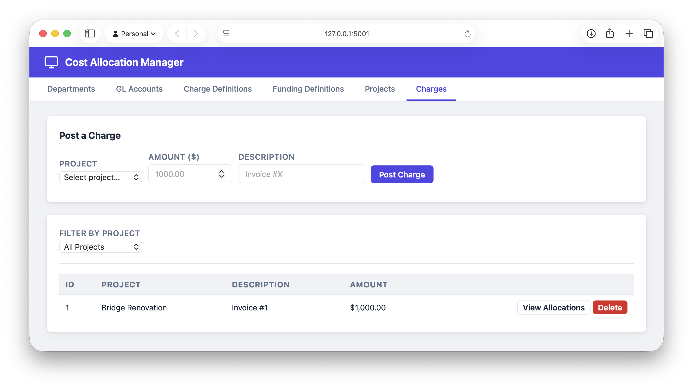
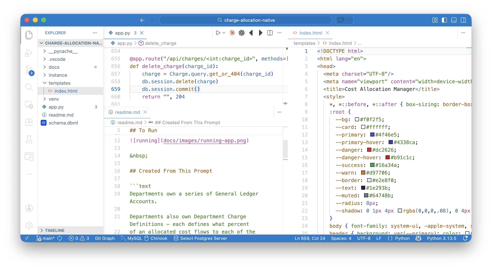
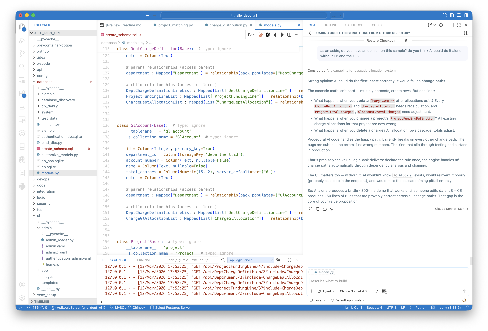

This system was created from AI in VSCode/Claude Sonnet 4.6.

&nbsp;

## To Run

```bash
source venv/bin/activate
python app.py   # not python3
```



&nbsp;

## Created From This Prompt

```text
Departments own a series of General Ledger Accounts.

Departments also own Department Charge Definitions — each defines what percent
of an allocated cost flows to each of the Department's GL Accounts.
An active Department Charge Definition must cover exactly 100% (derived: 
total_percent = sum of lines; is_active = 1 when total_percent == 100).

Project Funding Definitions define which Departments fund a designated percent
of a Project's costs, and which Department Charge Definition each Department
applies. An active Project Funding Definition must cover exactly 100% (derived:
total_percent = sum of lines; is_active = 1 when total_percent == 100).

Projects are assigned to a Project Funding Definition.

When a Charge is received against a Project, cascade-allocate it in two levels:
  Level 1 — allocate the Charge amount to each Department per their 
             Project Funding Line percent → creates ChargeDeptAllocation rows
  Level 2 — allocate each ChargeDeptAllocation amount to that Department's 
             GL Accounts per their Charge Definition line percents
             → creates ChargeGlAllocation rows

Constraint: a Charge may only be posted if the Project's 
Project Funding Definition is active.

Charges can be placed by contractors.  They may supply only a minimal project description to identify the Project - use AI Rules to find an Active Project based on a fuzzy match to project name, and past charges from the contractor.  For example, you might observe that a contractor works on roads vs construction.

Total the charges into the Project and GL Account.
```

&nbsp;

## Implementation Summary



&nbsp;

## Compare to GenAI-Logic Version

Claude Sonnet 4.6 quick guess as native vs. GenAI-Logic:




See how Claude Sonnet 4.6 compares this 'native' version to the reference GenAI-Logic implementation:

* [comparison](./docs/comparison_naive_vs_als.md)
* [exec summary](./docs/manager_3x5.md)

